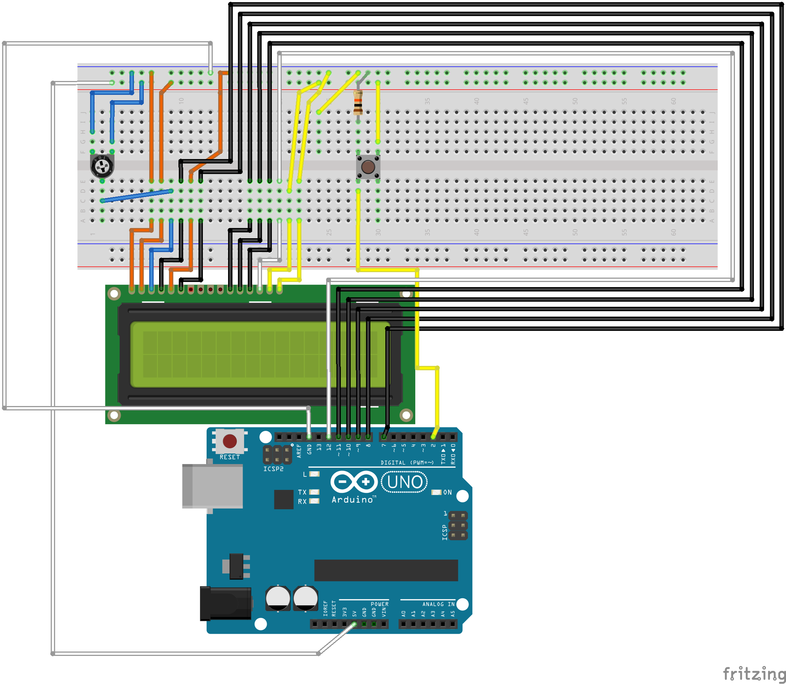

<h1 align="center">Nintza</h1>

Nintza Description

 

---

 

Arduino Schematics

 

Next part

# Credits

| Name    |    Work     |   Pic |
| :------ | :---------: | ----: |
| Alex    |   Writing   | [img] |
| Marcus  | 3D modeling | [img] |
| Tobsi   | Programming | [img] |
| William |   Arduino   | [img] |

<!--TODO:
Make Credits table.

-->